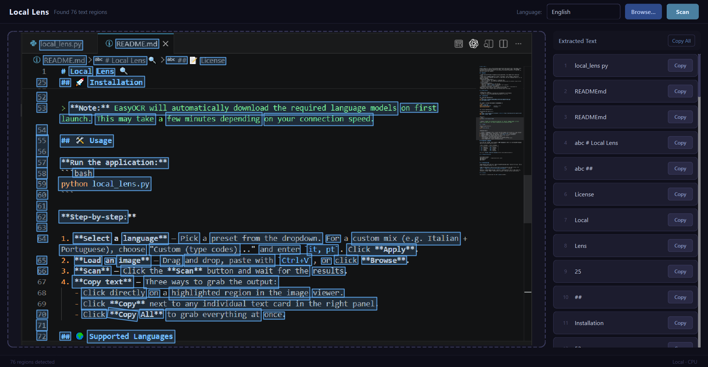

# Local Lens 🔍

**Local Lens** is a fast, offline desktop application that extracts text from images using AI-powered Optical Character Recognition (OCR). Built with Python, PyQt6, and EasyOCR — everything is processed directly on your machine. No internet connection, no cloud API, no data ever leaves your computer.

## ✨ Features

- **100% Local & Offline** — Complete privacy guaranteed. Your images never leave your machine.
- **Smart Multi-Language Support** — Choose from popular preset language combinations (English, Ukrainian, Japanese, and more), or type custom ISO 639-1 language codes to mix any supported languages.
- **Interactive Image Viewer**
  - Hover over detected text regions to highlight them.
  - **Click to Copy** — Left-click any highlighted bounding box to instantly copy its text to the clipboard.
- **Flexible Image Import**
  - Drag & drop images directly into the app.
  - Paste with `Ctrl+V` / `Cmd+V` straight from your clipboard.
  - Traditional file browser also supported.
- **Hardware Acceleration** — Automatically uses your GPU (CUDA) if available for significantly faster scanning, with a seamless CPU fallback.
- **Modern Dark UI** — Clean, responsive interface built with PyQt6.

## 🖼️ Screenshot



## 📋 Requirements

- Python 3.8 or higher
- An NVIDIA GPU with CUDA is optional but recommended for performance
- ~2–3 GB disk space for EasyOCR model downloads on first run

## 🚀 Installation

**1. Clone the repository:**
```bash
git clone https://github.com/BlackPencil-69/local-image-to-text.git
cd local-image-to-text
```

**2. Create a virtual environment (recommended):**
```bash
python -m venv venv
source venv/bin/activate       # macOS / Linux
venv\Scripts\activate          # Windows
```

**3. Install dependencies:**

*With NVIDIA GPU (CUDA 11.8):*
```bash
pip install torch torchvision torchaudio --index-url https://download.pytorch.org/whl/cu118
pip install easyocr PyQt6
```

*CPU only:*
```bash
pip install torch easyocr PyQt6
```

> **Note:** EasyOCR will automatically download the required language models on first launch. This may take a few minutes depending on your connection speed.

## 🛠️ Usage

**Run the application:**
```bash
python local_lens.py
```

**Step-by-step:**

1. **Select a language** — Pick a preset from the dropdown. For a custom mix (e.g. Italian + Portuguese), choose "Custom (type codes)..." and enter `it, pt`. Click **Apply**.
2. **Load an image** — Drag and drop, paste with `Ctrl+V`, or click **Browse**.
3. **Scan** — Click the **Scan** button and wait for the results.
4. **Copy text** — Three ways to grab the output:
   - Click directly on a highlighted region in the image viewer.
   - Click **Copy** next to any individual text card in the right panel.
   - Click **Copy All** to grab everything at once.

## 🌍 Supported Languages

Local Lens uses EasyOCR, which supports **80+ languages**. Enter any valid EasyOCR language code into the Custom field to use it.

| Code | Language   | Code | Language   |
|------|------------|------|------------|
| `en` | English    | `de` | German     |
| `uk` | Ukrainian  | `zh` | Chinese    |
| `ja` | Japanese   | `ar` | Arabic     |
| `fr` | French     | `ko` | Korean     |
| `es` | Spanish    | `ru` | Russian    |

Full list: [EasyOCR supported languages](https://www.jaided.ai/easyocr/)

## 🗂️ Project Structure

```
local-image-to-text/
├── local_lens.py       # Application entry point
├── README.md
└── LICENSE
```

## ❓ Troubleshooting

**App launches slowly the first time** — EasyOCR downloads model files on first use. This is normal; subsequent launches are fast.

**CUDA not detected** — Make sure your PyTorch version matches your CUDA version. Run `python -c "import torch; print(torch.cuda.is_available())"` to verify.

**Blurry or skewed images give poor results** — EasyOCR performs best on clear, well-lit, reasonably straight images. Preprocessing (cropping, rotating) can help significantly.

## 📝 License

This project is licensed under the [MIT License](LICENSE).
